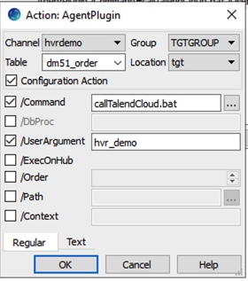

# Talend Command Line Interface #
## Version: 1.3.0 ##
### Author: Thomas Bennett <tbennett@talend.com> ###

The executables in this repository where built to support the following systems
* Windows <tcli.exe>
* Mac <tcli>
* Linux/Unix <tcli>

The log4j.properties file needs be downloaded as well and placed in the same directory
as the executable that you choose.

The following parameters can be used with the executable

| Command  | Description |
| --- | --- |
| -h,--help  | show help
| -j,--job \<arg> | The Talend Cloud Job Name to Execute
| -r,--region \<arg> | Talend Cloud Region [AWS_USA_EAST, AWS_EMEA, AWS_APAC, AZURE_USA_WEST]
| -t,--token \<arg> | Talend Cloud Token
| -te,--tokenenv \<arg> | Talend Cloud Token in Environment Variable
| -w,--wait | Will block any other commands from executing until Talend job is completed
| -v,--version | Product Version

# HVR Example
In working in conjuction with HVR to integrate their CDC platform to Talend Cloud we utilized the following script. The tcli executable
and log4j.properties was placed in the <$HVR_HOME>\lib\agent directory allow with the following script

`IF "%1%" == "integ_end" (
  tcli -t <TOKEN> -r AWS_USA_EAST -j %4% -w
 )`

### HVR Agent Plugin
In HVR we use the Agent Plugin to call our script. In this example we named the script `callTalendCloud.bat`

The value in the `UserArgument` is referenced in the above code by the `%4%`. This way a user
can pass in the name of the Talend Cloud Job and it will be executed in this instance with the HVR
process is at `integ_end`

### License
MIT - <http://www.opensource.org/licenses/mit-license.php

